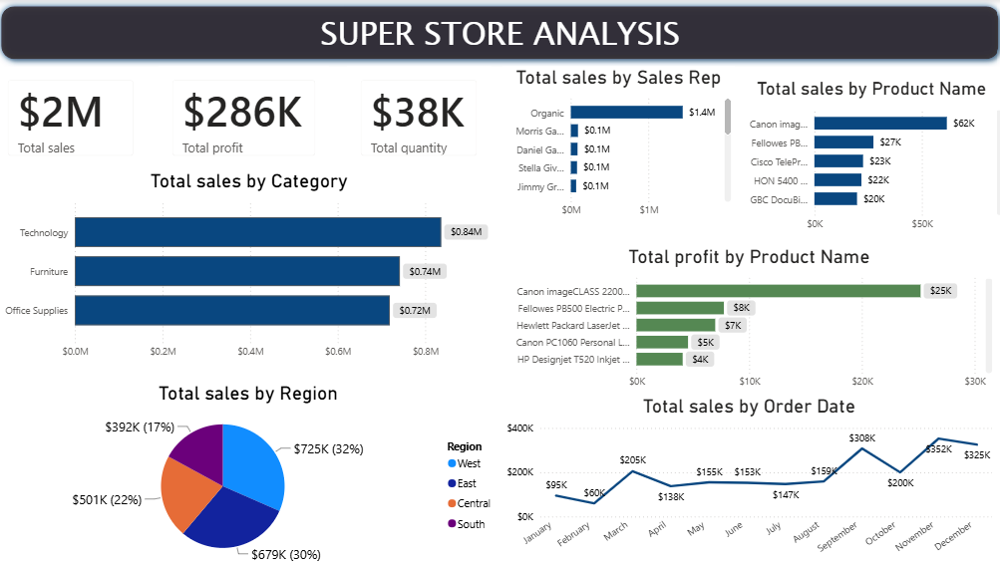

# Superstore Sales & Profitability Analysis

## 📊 Project Overview

An interactive Power BI dashboard developed to analyze sales performance, profitability, product performance, and regional trends using the Superstore Analysis dataset.

The dashboard provides a high-level view of sales, profit, and quantity while allowing users to explore performance across product categories, regions, sales representatives, products, and order dates.

## 🎯 Business Objective

The objective of this project was to transform raw sales data into an interactive business intelligence dashboard that enables users to monitor commercial performance and identify patterns across products, regions, sales representatives, and time.

The analysis focuses on understanding both **sales performance and profitability**, providing a broader view of business performance beyond revenue alone.

## 📈 Key Performance Indicators

The dashboard tracks three core KPIs:

| KPI | Dashboard Value |
|---|---:|
| Total Sales | ~$2M |
| Total Profit | ~$286K |
| Total Quantity | ~38K |

*Values are based on the dashboard view and may change depending on applied filters.*

## 🔍 Analysis Areas

The dashboard provides analysis across several dimensions:

- **Sales by Category** – Explore sales performance across different product categories.
- **Sales by Region** – Compare sales performance across geographic regions.
- **Sales by Sales Representative** – Analyze sales contribution across sales representatives.
- **Profit by Product** – Identify products contributing most to profitability.
- **Sales by Order Date** – Analyze sales trends over time.
- **Overall Performance** – Monitor sales, profit, and quantity through interactive KPIs.

## 🛠 Tools & Techniques

- **Power BI** – Dashboard development and data visualization
- **Power Query** – Data cleaning and transformation
- **DAX** – Data analysis and query development
- **DAX Query View** – Analytical queries and data exploration
- **Interactive Filters & Slicers** – Dynamic analysis across categories and other dimensions

## 🧮 DAX Analysis

DAX Query View was used to explore and analyze the dataset through analytical queries.

Techniques explored in this project include:

- `EVALUATE`
- `SUMMARIZECOLUMNS`
- `CALCULATE`
- `FILTER`
- `TOPN`
- `ROW`
- Aggregation functions such as `SUM()` and `AVERAGE()`

These techniques were used to explore sales performance, calculate aggregated metrics, filter data, compare results, and investigate specific segments of the dataset.

## 🖥 Dashboard Preview

## 💡 Key Takeaway

This project demonstrates how Power BI, Power Query, and DAX can be combined to transform raw sales data into an interactive business intelligence solution.

The dashboard enables stakeholder to evaluate sales and profitability across products, regions, sales representatives, and time, supporting data-driven commercial analysis.
